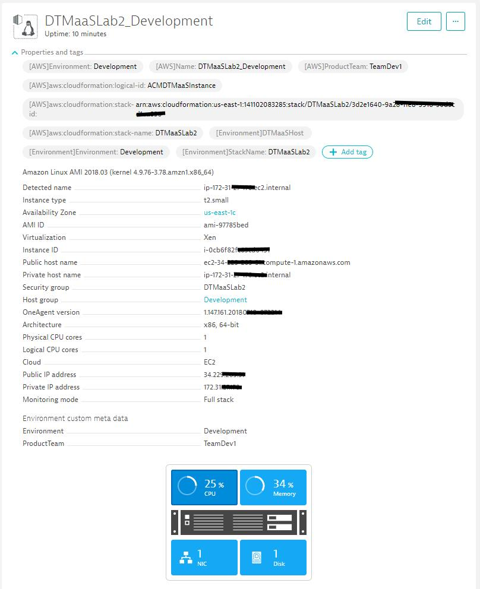
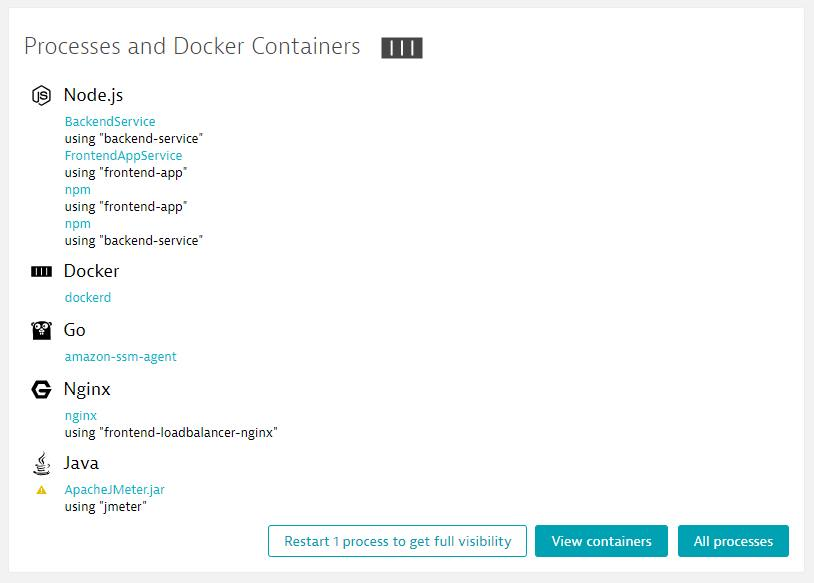

# Dynatrace Monitoring as a Service Tutorial
Goal: Update your current "Deployment Automation" to automatically rollout Dynatrace Fullstack monitoring across your infrastructure. Every host, app and service that gets deployed will automatically - without any additional configuration - deliver key metrics for the individual stakeholders: dev, architects, operations and business

In order to achieve that goal we will learn how to
* Automate installation of OneAgent, e.g: via CloudFormation, SaltStack, Terraform ...
* Pass additional meta data to your hosts and processes via hostautotag.conf, DT_TAGS, DT_CUSTOM_PROP ...
* Ensure proper PG (process group), PGI (process group instance) and service detection via detection rules
* Push additional deployment & configuration change event details to Dynatrace to enrich the AI's data set

## Introduction to our tutorial app & services
This tutorial comes with an AWS CloudFormation template that will create an EC2 Linux instance but comes with a set of options to simulate different "stages" of our "Monitoring as a Service" maturity level:
1. Install OneAgent? If YES - will automatically rollout OneAgent on the EC2 machine
2. Install Dynatrace CLI? If YES - will download Dynatrace CLI in a dockerized version for local use
3. Download this GitHub repo? If YES - will download all content of this GitHub repo (only works if this GitHub repo is publicly accessible)

The GitHub repo itself includes the following additional components
1. Node.js-based Web Application called "frontend-app"
2. Node.js-based Backend Service called "backend-service"
3. NGINX Load Balancer in front of 1 or multiple "frontend-app"s
4. JMeter load generation script

## Pre-Requisites
To walk through all labs of this tutorial you will need
1. An AWS Account: Dont have one? Register via http://aws.amazon.com
2. A Dynatrace SaaS Account: Dont have one? Register via http://bit.ly/dtsaastrial
3. Clone or download this GitHub repo to your local machine
4. In AWS you need an EC2 KeyPair in your default region
5. In Dynatrace you need to create an [API Token](https://www.dynatrace.com/support/help/dynatrace-api/authentication/how-do-i-set-up-authentication-to-use-the-api/)
6. In Dynatrace setup [AWS CloudWatch Monitoring](https://www.dynatrace.com/support/help/cloud-platforms/amazon-web-services/how-do-i-start-amazon-web-services-monitoring/)

**Best Practice:** For most of the labs we need to provide the following three input values:
1. Dynatrace SaaS Url
2. Dynatrace OneAgent Download URL
3. Dynatrace API Token
Make sure you have these values at hand, e.g: copy them into a text file so they are easily accessible

## Lab #1: Install our apps without any monitoring
**ATTENTION:** You can skip this lab in case you want to go straight to installing OneAgents. You should still read through the lab description as it explains how to build and launch the individual parts of our application.

**Step 1: Create Stack**
1. Login to your AWS Account
2. Make sure you have an AWS EC2 KeyPair
3. Go to [CloudFormation Stack](https://console.aws.amazon.com/cloudformation/home) and create a new stack with the name "DTMaaSLab1" by uploading [DynatraceMonitoringAsAServiceCFStack.json](../blob/master/DynatraceMonitoringAsAServiceCFStack.json)
4. Select "Yes" on "Step 0: Download dynatrace-monitoring-as-service Github" (keep the rest NO)
5. Fill in the 3 Dynatrace values even though not needed for this workshop
6. Walk until the end of the wizard - make sure to select "I acknolwedge ..." on the last step before creating the stack!

**Step 2: Launch app**
1. SSH into machine
2. ./run_frontend2builds_clustered.sh

This will run one instance of the backend-service, 4 instances of the frontend-service (2 running Build #1, 2 running Build #2) as well as the frontend NGINX-based load balancer. 

**Step 3: Browse the app**
1. Open your browser and navigate to the public IP or DNS of your EC2 machine. You should see the web interface and can interact with its services!

**Summary: What we have!**
We have a distributed application that we can access. 
As for  monitoring: The only level of monitoring you have in the moment is through the Dynatrace AWS CloudWatch integration which gives you basic infrastructure metrics for your EC2 instance!

## Lab 2: Enable FullStack Monitoring throuhg OneAgent rollout
In this lab we learn how to automate the installation of the Dynatrace OneAgent, how to pass in additional meta data about the host and how OneAgent automatically monitors all our processes, containers, services, applications and end-users!

**Step 1: Create stack**
1. Either keep or delete the old stack from Lab 1
2. Create a new stack based on the same CF Template and call it "DTMaaSLab2"
3. Select YES to install OneAgent and Dynatrace CLI

**Step 2: Launch app: Just as in Lab1**

**Step 3: Browse the app: Just as in Lab 1**

**Step 4: Execute some load**
We have a JMeter script ready that executes constant load against the app. Here are the steps to kick it off:
1. cd jmeter-as-container
2. ./build_docker.sh
3. ./quicklaunch.sh <YOURPUBLICDNS, e.g: http://ec2-11-222-33-44.compute-1.amazonaws.com>

This executes the script scripts/SampleNodeJsServiceTest.jmx. It simulates 10 concurrent users and the test will run until you call "./stop.test.sh". Once stopped you get the JMeter Result Dashboard in the local results.zip!

**Step 5: Explore automated monitoring result and how it works!**

Here are a couple of things that happened "automagically" due to the auto installation of OneAgent through this part of the CloudFormation Script.

*How to install the OneAgent? How to pass hostautotag.conf?*
Lets first look at the script so you can replicate this in your own scripts (CloudFormation, Terraform, Saltstack ...)
```json
"wget --no-check-certificate -O Dynatrace-OneAgent-Linux.sh \"",
{
    "Ref": "DynatraceOneAgentURL"
},
"\"\n",
"echo 'Ready to install & configure tags for OneAgent:'\n",
"mkdir -p /var/lib/dynatrace/oneagent/agent/config\n",
"cd /var/lib/dynatrace/oneagent/agent/config\n",
"echo \"MaaSHost StackName=",
{
    "Ref" : "AWS::StackName"
},
" ",
{
    "Ref" : "DynatraceCustomHostTags"
},
"\" > hostautotag.conf\n",
"cd /\n",
"sudo /bin/sh Dynatrace-OneAgent-Linux.sh APP_LOG_CONTENT_ACCESS=1\n"
```

This will result in an automated monitored host that should look simliar to this - including all tags from hostautotag.conf and all AWS Tags that came in through the AWS CloudWatch Integration:


*How were the individual processes detected? How about Process Groups?*
By default Dynatrace groups similiar processes into a Process Group. In our case we will get a Process Group (PG) for each individual Docker Image, e.g: frontend-app, backend-app, frontend-loadbalancer.
For each host where we have one or more instances of the same process or container running we will get one Process Group Instance (PGI). In our case that means that we will see one PGI for frontend-app, one for backend-app and one for frontend-loadbalancer.
The fact that we have multiple instances of the same container on the same host doesnt give us individual PGIs. That is the default behavior!




## Lab 3: Pass Meta-Data for each deployed process or container

## Lab 4: Pass Deployment & Configuration Change Events to Dynatrace

## Lab 5: Management Zones: Provide Access Control to data based on Meta-Data

## Lab 6: Automatically query key metrics important for YOU!

## Lab 7: Run stack for second environment and validation automation
Now as we have everything correctly setup and configured for our first environment lets do the same thing for a second enviornment:
1. Create a second