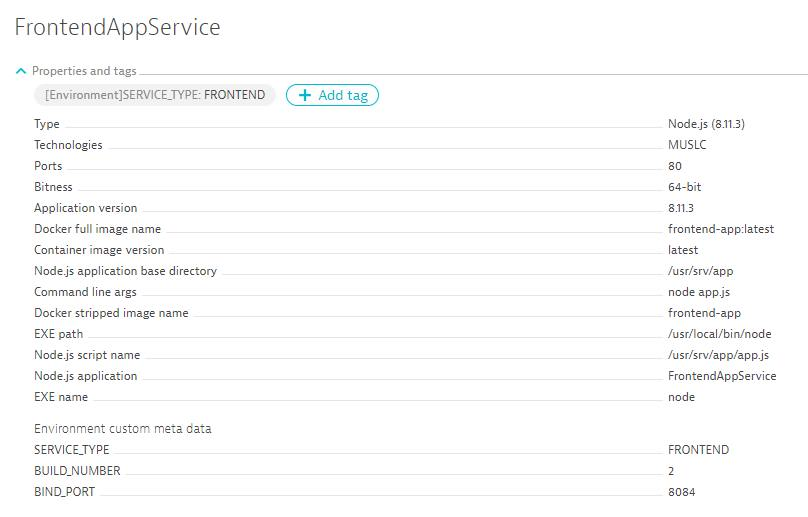
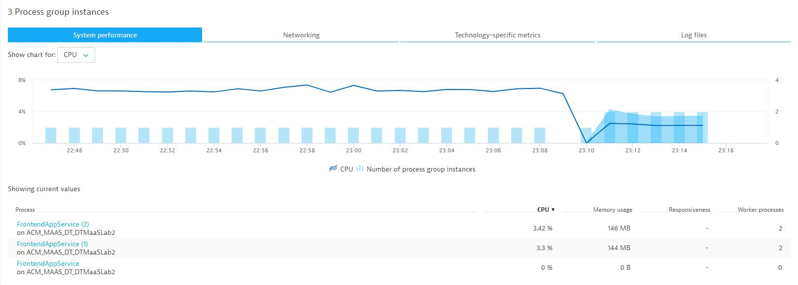
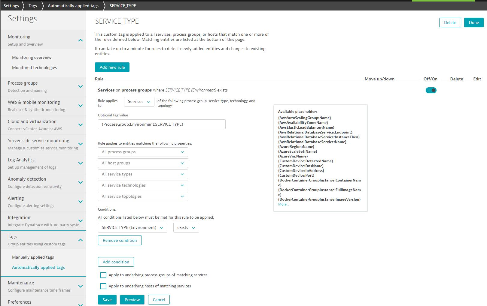
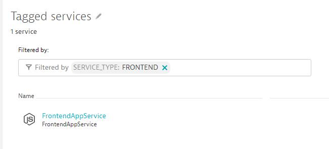

**DISCLAIMER:** This tutorial is currently under development by the Dynatrace Innovation Lab! If you have any questions please get in contact with me (@grabnerandi)!

# Dynatrace Monitoring as a Service Tutorial
Goal: Update your current "Deployment Automation" to automatically rollout Dynatrace Fullstack monitoring across your infrastructure. Every host, app and service that gets deployed will automatically - without any additional configuration - deliver key metrics for the individual stakeholders: dev, architects, operations and business

In order to achieve that goal we will learn how to
* Automate installation of OneAgent, e.g: via CloudFormation, SaltStack, Terraform ...
* Pass additional meta data to your hosts and processes via hostautotag.conf, DT_TAGS, DT_CUSTOM_PROP ...
* Ensure proper PG (process group), PGI (process group instance) and service detection via detection rules
* Push additional deployment & configuration change event details to Dynatrace to enrich the AI's data set

## Introduction to our tutorial app & services
This tutorial comes with an AWS CloudFormation template that will create an EC2 Linux instance but comes with a set of options to simulate different "stages" of our "Monitoring as a Service" maturity level:
1. Install OneAgent? If YES - will automatically rollout OneAgent on the EC2 machine
2. Install Dynatrace CLI? If YES - will download Dynatrace CLI in a dockerized version for local use
3. Download this GitHub repo? If YES - will download all content of this GitHub repo (only works if this GitHub repo is publicly accessible)

The GitHub repo itself includes the following additional components
1. Node.js-based Web Application called "frontend-app"
2. Node.js-based Backend Service called "backend-service"
3. NGINX Load Balancer in front of 1 or multiple "frontend-app"s
4. JMeter load generation script

## Pre-Requisites
To walk through all labs of this tutorial you will need
1. An AWS Account: Dont have one? Register via http://aws.amazon.com
2. A Dynatrace SaaS Account: Dont have one? Register via http://bit.ly/dtsaastrial
3. Clone or download this GitHub repo to your local machine
4. In AWS you need an EC2 KeyPair in your default region
5. In Dynatrace you need to create an [API Token](https://www.dynatrace.com/support/help/dynatrace-api/authentication/how-do-i-set-up-authentication-to-use-the-api/)
6. In Dynatrace setup [AWS CloudWatch Monitoring](https://www.dynatrace.com/support/help/cloud-platforms/amazon-web-services/how-do-i-start-amazon-web-services-monitoring/)
7. FORK or IMPORT https://github.com/dynatrace-innovationlab/dynatrace-monitoring-as-service.git into your own GitHub proejct if you want to walk through Labs 3 and beyond! These require some code modifications that we will commit back to GitHub

**Best Practice:** For most of the labs we need to provide the following input values:
1. Dynatrace SaaS Url
2. Dynatrace OneAgent Download URL
3. Dynatrace API Token
4. Your GitHub Repo link!
Make sure you have these values at hand, e.g: copy them into a text file so they are easily accessible

## Lab #1: Install our apps without any monitoring
**ATTENTION:** You can skip this lab in case you want to go straight to installing OneAgents. You should still read through the lab description as it explains how to build and launch the individual parts of our application.

**Step 1: Create Stack**
1. Login to your AWS Account
2. Make sure you have an AWS EC2 KeyPair
3. Go to [CloudFormation Stack](https://console.aws.amazon.com/cloudformation/home) and create a new stack with the name "DTMaaSLab1" by uploading [DynatraceMonitoringAsAServiceCFStack.json](../blob/master/DynatraceMonitoringAsAServiceCFStack.json)
4. Select "Yes" on "Step 0: Download dynatrace-monitoring-as-service Github" (keep the rest NO)
5. If you have created your own GitHub repo then provide the link - otherwise go with the default
6. Fill in the 3 Dynatrace values even though not needed for this workshop
7. Walk until the end of the wizard - make sure to select "I acknolwedge ..." on the last step before creating the stack!

**Step 2: Launch app**
1. SSH into machine
2. ./run_frontend2builds_clustered.sh

This will run one instance of the backend-service, 4 instances of the frontend-service (2 running Build #1, 2 running Build #2) as well as the frontend NGINX-based load balancer. 

**Step 3: Browse the app**
1. Open your browser and navigate to the public IP or DNS of your EC2 machine. You should see the web interface and can interact with its services!

**Step 4: Learn how to redeploy app**
1. ./stop_frontend_clustered.sh will STOP ALL components (load balancer, frontend & backend)
2. ./stop_docker.sh in subdirectories allow for stopping all tiers independantly.
3. ./frontend-app/run_docker.sh allows for launching a specific build with certain instance count and bind port
4. ./frontend-loadbalancer/run_docker.sh allows to launch nginx for a number of available frontend-app instances

Before launching frontend, backend or frontend-loadbalancer have a look at the run_docker.sh files for usage information!

**Summary: What we have!**
We have a distributed application that we can access. 
As for  monitoring: The only level of monitoring you have in the moment is through the Dynatrace AWS CloudWatch integration which gives you basic infrastructure metrics for your EC2 instance!

## Lab 2: Enable FullStack Monitoring throuhg OneAgent rollout
In this lab we learn how to automate the installation of the Dynatrace OneAgent, how to pass in additional meta data about the host and how OneAgent automatically monitors all our processes, containers, services, applications and end-users!
We also learn about tagging and how to organize your entities. We highly recommend to read [Best practices on organize monitored entities](https://www.dynatrace.com/support/help/organize-monitored-entities/)

**Step 1: Create stack**
1. Either keep or delete the old stack from Lab 1
2. Create a new stack based on the same CF Template and call it "DTMaaSLab2"
3. Select YES to install OneAgent and Dynatrace CLI
4. Keep the rest the same as before

**Step 2: Launch app: Just as in Lab1**

**Step 3: Browse the app: Just as in Lab 1**

**Step 4: Execute some load**
We have a JMeter script ready that executes constant load against the app. Here are the steps to kick it off:
1. cd jmeter-as-container
2. ./build_docker.sh
3. ./quicklaunch.sh <YOURPUBLICDNS>, e.g: ./quicklaunch.sh ec2-11-222-33-44.compute-1.amazonaws.com

This executes the script scripts/SampleNodeJsServiceTest.jmx. It simulates 10 concurrent users and the test will run until you call "./stop.test.sh". Once stopped you get the JMeter Result Dashboard in the local results.zip!

**Step 5: Explore automated monitoring result and how it works!**

Here are a couple of things that happened "automagically" due to the auto installation of OneAgent through this part of the CloudFormation Script.

*How to install the OneAgent? How to pass hostautotag.conf?*
Lets first look at the script so you can replicate this in your own scripts (CloudFormation, Terraform, Saltstack ...)
```json
"wget --no-check-certificate -O Dynatrace-OneAgent-Linux.sh \"",
{
    "Ref": "DynatraceOneAgentURL"
},
"\"\n",
"echo 'Ready to install & configure tags for OneAgent:'\n",
"mkdir -p /var/lib/dynatrace/oneagent/agent/config\n",
"cd /var/lib/dynatrace/oneagent/agent/config\n",
"echo \"MaaSHost StackName=",
{
    "Ref" : "AWS::StackName"
},
" ",
{
    "Ref" : "DynatraceCustomHostTags"
},
"\" > hostautotag.conf\n",
"cd /\n",
"sudo /bin/sh Dynatrace-OneAgent-Linux.sh APP_LOG_CONTENT_ACCESS=1\n"
```

This will result in an automated monitored host that should look simliar to this - including all tags from hostautotag.conf and all AWS Tags that came in through the AWS CloudWatch Integration:


*How were the individual processes detected? How about Process Groups?*
By default Dynatrace groups similiar processes into a [Process Group](https://www.dynatrace.com/support/help/infrastructure/processes/what-are-processes-groups/). In our case we will get a Process Group (PG) for each individual Docker Image, e.g: frontend-app, backend-app, frontend-loadbalancer as this is the default behavior!


If we run multiple process or docker instances of the same process or container image, Dynatrace will group them all into a single Process Group Instance (PGI). In our case that means that we will see ONE PGI for frontend-app, ONE for backend-app and ONE for frontend-loadbalancer.
The fact that we have multiple instances of the same container on the same host doesnt give us individual PGIs. That is the default behavior! We have ways to change that behavior through Process Group Detection rules or by using some of the DT_ environment variables. We will use this later one to get different PGIs for the different simulated builds of our frontend service, e.g: PGI for Build 1, Build 2, ... - for now we go with the default!

**Lab Lessons Learned**
1. Deploying OneAgent will automatically enable FullStack Monitoring
2. hostautotag.conf will automatically push custom tags to the host entity
3. Process Group (PG) and Process Group Instance (PGI) are automatically detected for each docker image

## Lab 3: Pass and Extract Meta-Data for each deployed Process or Container
In this lab we learn how which meta-data is captured automatically, how to pass custom meta data and how we can use this meta data to influence process group detection and automated tagging!

The OneAgent automatically captures a lot of meta data for each process which will be propagated to the Process Group Instance and the Process Group itself, e.g: Technology, JVM Version, Docker Image, Kubernetes pod names, service version number, ...

*Add custom meta data:* We can add additional meta data to every processes [via the environment variable DT_CUSTOM_PROP, DT_TAGS, ...](https://www.dynatrace.com/support/help/infrastructure/processes/how-do-i-define-my-own-process-group-metadata/)

*Which additional meta data should we pass?*
It depends on your environment but here are some ideas, e.g: Build Number, Version Number, Team Ownership, Type of Service, ...

*Using Meta Data (How and Use Cases):* We can use custom and existing meta data from, e.g: Java Properties, Environment Variables or Process Properties to influence [Process Group Detection](https://www.dynatrace.com/support/help/infrastructure/processes/can-i-customize-how-process-groups-are-detected/) as well as [Rule-based Tagging](https://www.dynatrace.com/news/blog/automated-rule-based-tagging-for-services/)!

**Step 1: Pass meta data via custom environment variables**
1. Edit frontend-app/run_docker.sh
2. Change the comments to use the launch process labeled **Step 1** (make sure the other lines are commented)
3. Lets restart our app via ../stop_frontend_clustered.sh and then ../run_frontend2builds_clustered.sh

Looking at our Process Groups now shows us the additional Meta Data and the Automated Tags!



**Step 2: Influence PGI Detection to detect each Build as separate PGI**
1. Edit frontend-app/run_docker.sh
2. Change the comments to use the launch process labeled **Step 2** (make sure the other lines are commented)
3. Lets restart our app via ../stop_frontend_clustered.sh and then ../run_frontend2builds_clustered.sh

The difference with this launch process is that we pass the BUILD_NUMBER as DT_NODE_ID. This changes the default Process Group Instance detection mechanism and every docker instance, even if it comes from the same docker image, will be split into its own PGI.
**Note: Kubernetes, OpenShift, CloudFoundry, ...:** For these platforms the OneAgent automatically detects containers running in different pods, spaces or projects. There should be no need to leverage DT_NODE_ID to separate your container instances.



**Lab Lesson Learned**
1. How to pass additional meta data to a process group
2. How to influence process group and process group instance detection

## Lab 4: Tagging of Services
In this lab we learn how to automatically apply tags on service level. This allows you to query service-level metrics (Respone Time, Failure Rate, Throughput, ...) automatically based on meta data that you have passed during a deployment, e.g: Service-Type (Frontend, Backend, ...), Deployment Stage (Dev, Test, Staging, Prod ...)

In order to tag services we leverage Automated Service Tag Rules. In our lab we want Dynatrace create a new Service-level TAG with the name "SERVICE_TYPE". It should only apply the tag IF the underlying Process Group has the custom meta data property "SERVICE_TYPE". If that is the case we also want to take that value and apply it as the tag value for "Service_Type". 

**Step 1: Create Service tag rule**
1. Go to Settings -> Tags -> Automatically applied tags
2. Create a new Tag with the name "SERVICE_TYPE"
3. Edit that tag and create a new rule
3.1. Rule applies to Services
3.2. Optional tag value: {ProcessGroup:Environment:SERVICE_TYPE}
3.3. Condition on "Process group properties -> SERVICE_TYPE" if "exists" 
4. Click on Preview to validate rule works
5. Click on Save for the rule and then "Done"

Here is the screenshot that shows that rule definition!


**Step 2: Search for Services with Tag**
It will take about 30s until the tags are automatically applied to the services. So - lets test it
1. Go to Transaction & services
2. Click in "Filtered by" edit field
3. Select "ServiceType" and select "Frontend"
4. You should see your service! Open it up!



**Step 3: Create Tagging Rule for Environment**
Define a Service-level tagging rule for a tag called "Environment".  Extract the Tag Value from the Process Group's Environment value "Enviornment". Make sure to only apply this rule if ProcessGroup:Environment exists!

**Lab Lesson Learned**
1. Create automated tagging rules to apply tags to services

## Lab 5: Pass Deployment & Configuration Change Events to Dynatrace
Passing meta data is one way to enrich the meta data in Smartscape and the automated PG, PGI and Service detection and tagging. Additionally to meta data we can also push deployment and configuration changes events to these Dynatrace Entities.

The Dynatrace Event API provides a way to either push a Custom Annotation or a Custom Deployment Event to a list of entities or entities that match certain tags. More on the [Dynatrace Event API can be found here](https://www.dynatrace.com/support/help/dynatrace-api/events/how-do-i-push-events-from-3rd-party-systems/).

The Dynatrace CLI also implements a dtcli evt push option as well as an option that is part of "Monitoring as Code" (Monspec). This is what we are going to use in our lab. We already have a pre-configured monspec.json file available that contains the definition of how our host can be identified in Dynatrace.

**Step 1: Push host deployment information**
1. cat ./monspec/monspec.json
2. Explore the entry "MaaSHost". You will see that it contains sub elements that define how to detect that host in Dynatrace in our Lab2
3. Execute ./pushhostdeploy.sh
4. Open the host details view in Dynatrace and check the events view


*What just happened?* The Dynatrace CLI was called with the monspec and the pipelineinfo.json as parameter. One additional parameter was MaaSHost/Lab2. This told the CLI to lookup this configuration section in monspec.json and then push a custom deployment event to those Dynatrace HOST entities that have that particular tag (Environment=MaaSHost) on it. Such an event in Dynatrace can have an arbritrary list of name/value pair properties. The CLI automatically pushes some of the information from monspec, e.g: Owner as well as some information in the pipelineinfo.json file to Dynatrace!

**Step 2: Push service deployment information**
1. cat ./monspec/monspec.json
2. Explore the entry "FrontendApp". You will see similiar data as for our host. But now its a SERVICE and we use our SERVICE_TYPE tag to identify it
3. Execute ./pushservicedeploy.sh
4. Open the service details view for your FrontendApp service


**Lab Lesson Learned**
1. The concept of "Monitoring as Code" monspec.json file
2. Push deployment information to entities defined in monspec.json

## Lab 6: Management Zones: Provide Access Control to data based on Meta-Data
[Management Zones](https://www.dynatrace.com/news/blog/grant-fine-grained-access-rights-using-management-zones-beta/) allow us to define who is going to see and who has access to what type of FullStack data. There are many ways to slice your environment - and it will depend on your organizational structure & processes.
In our tutorial we can assume that we have the following teams
* a Frontend and a Backend Team (responsible for any Node.js services)
* a Dev Team responsible for the whole Development Environment
* an Architecture Team responsible for Development & Staging
* an Operations Team responsible for all Infrastructure (=all Hosts)
* a Business Team responsible for all applications

Lets create Management Zones that will give each team access to the data they are supposed to see!

**Step 1: Create Management Zone for Frontend & Backend**
1. Go to Settings -> Preferences -> Management Zones
2. Create a Zone named "Frontend Services"
3. Add a new rule for "Services"
4. Define a condition for SERVICE_TYPE=FRONTEND
5. Select "Apply to underlying process groups of matching services"
6. Add a second rule for SERVICE_TYPE=BACKEND
7. Save and test the Management Zone in the Smartscape View

**Step 2: Create Management Zone for Dev Team**
Create a Zone that shows ALL entities that are tagged with Environment=Development

**Step 3: Create Management Zone for Architect Team**
Create a Zone that shows ALL entities that are tagged with Environment=Development or Environment=Staging

**Step 4: Create Management Zone for Operations**
Create a Zone for all HOSTS & Processes.

**Step 5: Create Management Zone for Business**
Create a Zone that covers all Web Applications

**Lab Lesson Learned**
1. Management Zones allow us to create filter on all fullstack monitored data
2. Management Zones can also be used for access control!

## Lab 7: Automatically query key metrics important for YOU!
The Dynatrace REST API provides easy access to [Smartscape (=Topology Data)](https://www.dynatrace.com/support/help/dynatrace-api/topology-and-smartscape/what-does-the-topology-and-smartscape-api-provide/) as well as [Timeseries (=Performance Metrics)](https://www.dynatrace.com/support/help/dynatrace-api/timeseries/how-do-i-fetch-the-metrics-of-monitored-entities/). Basically everything we see in the Dynatrace UI can be queried and accessed via the API. This allows us to answer questions such as
- Whats the response time of my backend-service?
- How many users access our application through the browser?
- On how many PGIs does our fronent-app service run on?
- How many service dependencies does our frontend-app have?

*Monitoring as Code*
To make querying of key metrics of certain entities and services easier we extend our "Monitoring as Code" (=monspec.json) with a list of key timeseries and smartscape metrics that we want to analyze. In monspec.json we can define these metrics in the "perfsignature" (Performance Signature) config element Our tutorial already has some of these metrics pre-defined for our host and frontend-app service.

*Monspec in Dynatrace CLI*
The Dynatrace CLI implements a couple of use cases to pull, compare or even pull & push data for one of our monitored entities in a specific environment. In this tutorial we have a helper shell script called pullmonspec.sh which we can use to pull all "perfsignature" metrics for a specific Entity in a certain Environment, e.g: MaaSHost/Lab2 would pull in all metrics defined for MaaSHost and will do it for the Host runs in Lab2 Environment!

**Step 1: Explore perfsignature list in monspec.json**
1. cat /monspec/monspec.json
2. Explore the list of metrics and see how to define new ones

**Step 2: Pull these metrics from Dynatrace via the Dynatrace-CLI**
1. ./pullmonspec.sh MaaSHost/Lab2
2. ./pullmonspec.sh FrontendApp/Dev

**Lab Lesson Learned**
1. How "Monitoring as Code" monspec.json allows us to define key performance & smartscape metrics (=Performance Signature)
2. Pull the Performance Signature metrics in an automated way

## Lab 8: Run stack for second environment and validation automation
Now as we have everything correctly setup and configured for our first environment lets do the same thing for a second enviornment like this

**Step 1: Create second enviornment, e.g: Staging**
1. Create a new CF Stack based on the same CF Template
2. Create a new stack based on the same CF Template and call it "DTMaaSLab8"
3. Select YES to install OneAgent and Dynatrace CLI
4. For "DynatraceCustomHostProperties" specify "Environment=Staging"
5. Lets create the stack and explore what we see in Dynatrace

**Lab Lesson Learned**
1. With all automation in place Dynatrace correctly tags all entities
2. Dashboards and Management Zones work based on Infrastructure as Code Meta Data

## Lab 9: Setup Notification Integration
The last lab is about setting up your problem notification integration with your ChatOps or other incident management tools. 

## Lab 10: Setup Availability Checks
Additionally to automated Real User Monitoring (RUM) where Dynatrace automatically alerts on problems impacting real user experience we can also setup specific synthetic tests to validate availability and performance for our key business transaction and service endpoints.

**Step 1: Create Synthetic Monitor for Staging**
1. Go to Synthetic
2. Create a new Synthetic Test for our Staging Web Site
3. Validate Synthetic Test is producing results
4. Shutdown Staging Frontend-Loadbalancer to simulate an Availability Issue
5. Create a Notification Integration that sends an alert to Business
6. Restart Staging Frontend-Loadbalancer
7. Simulate another issue and validate notification works!

**Lab Lesson Learned**
1. Dynatrace can alert Business on Availabilty or Performance Issues with key business transactions

## Lab 11: Dashboarding
Dynatrace provides rich dashboarding capabilities. As a last step we want to create default dashboards for development, business and operations.